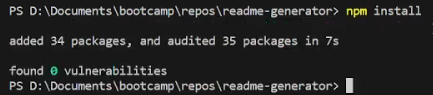

# Readme Generator
## **Description**
This is a console guided application designed to automate some of the process of creating a readme file. 

This Readme file was generated with the readme generator.

## **Table of Contents**

* Description
* Installation Instructions
* Usage
* License
* Tests
* Questions
## **Installation Instructions**
* First, you need to download the repository. After that, right click on the index.js and open it in a dedicated terminal. From there type the following commands into your console:
```
npm install
```
* After the installation is complete, you should see the following in your console:



* Verify that the "node_modules" folder now exists in your files.

* Before using the program, delete any files that already exist with the name "README.md".

## **Usage**
* Type the following into your console:
```
node index.js
```
* After that, follow the instructions on your console to create your readme file. Ensure you save each file that opens in your text editor, else the program does not continue and you will have to reopen your editor and type "node index.js" again to start over.

* When you follow all of the instructions in the console, you can open your new README.md file, which should look something like this: 


* You can also view the following video to see exactly how to use this application: https://www.youtube.com/watch?v=M_K51zgfRPE

## **License**
Using license: MIT License

## **Tests**
To test this program, follow the instructions listed above.

## **Questions**
### **Why does my program refuse to continue?** *****
The answer is that you most likely didn't save your file in your text editor, therefore you will have to start over again unless you can find the tmp file the program is looking for.
